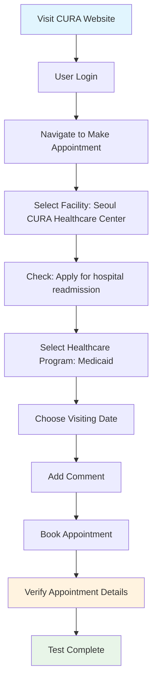

# CURA Healthcare Center - Cypress Test Automation

> Automated testing suite for the CURA Healthcare Center appointment booking system using Cypress framework.

## Project Overview

This project automates the end-to-end testing of the appointment booking process on the CURA Healthcare Center demo website. The test suite covers the complete user journey from login to appointment verification.

**Test Site:** https://katalon-demo-cura.herokuapp.com/

## Test Flow



## Test Scenario Details

The automated test performs the following steps:

1. **Website Navigation** - Access the CURA Healthcare Center demo site
2. **User Authentication** - Login with valid credentials
3. **Appointment Booking Process**:
   - Select facility: **Seoul CURA Healthcare Center**
   - Enable hospital readmission option
   - Choose healthcare program: **Medicaid**
   - Select preferred visiting date
   - Add appointment comments
   - Submit booking request
4. **Verification** - Confirm appointment details and successful booking

## Technology Stack

| Technology      | Purpose                      |
| --------------- | ---------------------------- |
| **Cypress**     | End-to-end testing framework |
| **JavaScript**  | Test scripting language      |
| **Mochawesome** | Test reporting and analytics |

## Prerequisites

Before running this project, ensure you have:

- Node.js (v14 or higher) installed on your system
- npm package manager
- Git for cloning the repository

## Getting Started

### 1. Clone the Repository

```bash
git clone <repository-url>
cd cura-healthcare-cypress-tests
```

### 2. Install Dependencies

```bash
npm install
```

### 3. Install Mochawesome Reporter (Optional)

```bash
npm install cypress-mochawesome-reporter
```

_Note: Mochawesome reporter installation is optional for enhanced test reporting capabilities_

## Running Tests

### Interactive Mode (Cypress Test Runner)

```bash
npx cypress open
```

_Opens the Cypress Test Runner GUI for interactive test execution_

### Headless Mode (Command Line)

```bash
npx cypress run
```

_Runs tests in headless mode, suitable for CI/CD pipelines_

## Test Execution Examples

### CLI Execution

Below are examples of running tests using the command line interface:


### Dashboard Execution

Examples of test execution using the Cypress dashboard:


## Project Structure

```
project-root/
├── cypress/
│   ├── e2e/
│   │   └── appointment-booking.cy.js
│   ├── fixtures/
│   ├── support/
│   └── reports/
├── cypress.config.js
├── package.json
└── README.md
```

---

**Happy Testing!**
